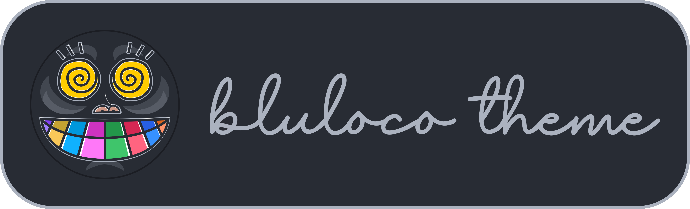

# Bluloco Dark VSCode Theme

### Description

A fancy and sophisticated dark color scheme / theme for
Visual Studio Code.

This theme features a much more comprehensive usage of syntax scopes and color
consistency, with due regards to aesthetics, contrast and readability.
Originally forked from the beautiful One Dark Theme, enhanced with the
meaningful intuitive Bluloco color palette.

This theme also works very good when Apple's **Nightshift Mode** is activated.

Give it a try :)

### Support

If you like using this, please consider donating a little bit. It takes a lot of time to keep this updated with every VSCode release.
I want to keep bluloco a great experience for everybody and your help would be immensely motivating to keep me doing this. :)

 

## Syntax Palette

| Scope                | Color                                            | HEX     | RGB                |
| -------------------- | ------------------------------------------------ | ------- | ------------------ |
| Background           |  | #282c34 | rgb(40, 44, 52)    |
| Foreground           |  | #abb2bf | rgb(171, 178, 191) |
| Comment              |  | #636d83 | rgb(99, 109, 131)  |
| Keyword              |  | #10b1fe | rgb(16, 177, 254)  |
| Function/Method      |  | #3fc56b | rgb(63, 197, 107)  |
| Property             |  | #ce9887 | rgb(206, 152, 135) |
| String               |  | #f9c859 | rgb(249, 200, 89)  |
| Number               |  | #ff78f8 | rgb(255, 120, 248) |
| Constant             |  | #9f7efe | rgb(159, 126, 254) |
| Markup Tag           |  | #3691ff | rgb(54, 145, 255)  |
| Markup Attribute     |  | #ff936a | rgb(255, 147, 106) |
| Class/Type/Interface |  | #ff6480 | rgb(255, 100, 128) |
| Operator/Punctuation |  | #7a82da | rgb(122, 130, 218) |

## Screenshots

Here are a bunch of screenshots. I tested a long range of languages, these are just a few.
You can test them all in this repo:
https://github.com/uloco/syntax-highlighting-samples

